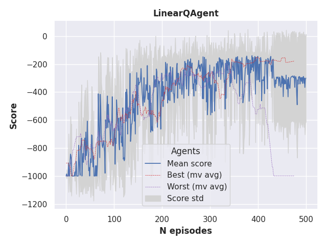
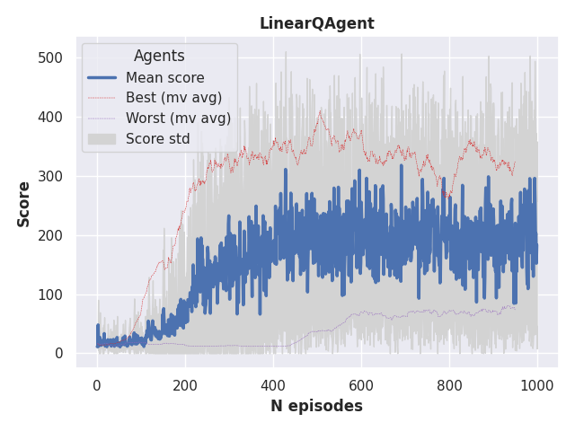
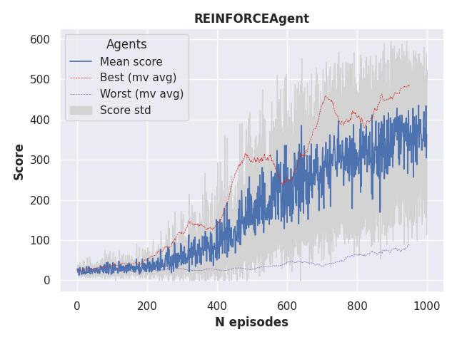

# Reinforcement learning in Keras
 [](https://sonarcloud.io/dashboard?id=garethjns_reinforcement-learning-keras)

This repo aims to implement various reinforcement learning agents using Keras (tf==2.2.0) and sklearn, for use with OpenAI Gym environments.
 

 
# Planned agents
- Methods
  - Off-policy
      - Linear Q learning
        - [x] Mountain car
        - [x] CartPole
      - Deep Q learning
        - [x] Mountain car
        - [x] CartPole
        - [x] Pong
        - Model extensions
          - [x] Replay buffer
          - [ ] Unrolled Bellman
          - [x] Dueling architecture
          - [ ] Multiple environments
          - [x] Double DQN
          - [ ] Noisy network
    - [ ] Policy gradient methods    
        - [x] REINFORCE
            - [ ] Mountain car
            - [x] CartPole
            - [ ] Pong
        - [ ] Actor-critic
            - [ ] Mountain car
            - [ ] CartPole
            - [ ] Pong
            

# General references
 - [Deep reinforcement learning hands-on, 2nd edition](https://www.amazon.co.uk/Deep-Reinforcement-Learning-Hands-optimization/dp/1838826998/), Maxim Lapan
 - [The Lazy Programmers'](https://lazyprogrammer.me/) courses: 
   - [Artificial Intelligence: Reinforcement learning in Python](https://www.udemy.com/course/artificial-intelligence-reinforcement-learning-in-python/learn/)
   - [Advanced AI: Deep reinforcement learning in Python](https://www.udemy.com/course/deep-reinforcement-learning-in-python/learn/)
   - [Cutting-edge AI: Deep reinforcement learning in Python](https://www.udemy.com/course/cutting-edge-artificial-intelligence/learn/)
 - Lilian Weng's overviews of reinforcement learning. I try and use the same terminology as used in these posts.
   - [A (Long) Peek into Reinforcement Learning](https://lilianweng.github.io/lil-log/2018/02/19/a-long-peek-into-reinforcement-learning.html)
   - [Policy Gradient Algorithms](https://lilianweng.github.io/lil-log/2018/04/08/policy-gradient-algorithms.html)
 - Multiple Github repos and Medium posts on individual techniques - these are cited in context.
   
# Set-up
````bash
git clone 
cd reinforcement-learning-keras
pip install -r requirements.txt
````

# Deep Q learner
## Pong
Pong-NoFrameSkip-v4 with various wrappers.

   

Model:  
State -> action model -> [value for action 1, value for action 2] 

A [deep Q learning](https://www.nature.com/articles/nature14236) agent that uses small neural network to approximate Q(s, a). It includes a replay buffer that allows for batched training updates, this is important for 2 reasons:
 - As this method is off-policy (the action is selected as argmax(action values)), it can train on data collected during previous episodes. This reduces correlation in the training data.
 - This is important for performance, especially when using a GPU. Calling multiple predict/train operations on single rows inside a loop is very inefficient. 

This agent uses two copies of its model:
 - One to predict the value of the next action, which us updated every episode step (with a batch sampled from the replay buffer)
 - One to predict value of the actions in the current and next state for calculating the discounted reward. This model is updated with the weights from the first model at the end of each episode.

### Run example
````python
from reinforcement_learning_keras.agents.components.helpers.virtual_gpu import VirtualGPU
from reinforcement_learning_keras.agents.q_learning.deep_q_agent import DeepQAgent
from reinforcement_learning_keras.enviroments.atari.pong.pong_config import PongConfig

VirtualGPU(4096) 
agent = DeepQAgent(**PongConfig('dqn').build())
agent.train(verbose=True, render=True, max_episode_steps=10000)
````


## Cart-pole
Using cart-pole-v0 with step limit increased from 200 to 500.

![Episode play example]images/DQNAgent.gif) ![Convergence]images/DQNAgent.png)  

### Run example
````python
from reinforcement_learning_keras.agents.components.helpers.virtual_gpu import VirtualGPU
from reinforcement_learning_keras.agents.q_learning.deep_q_agent import DeepQAgent
from reinforcement_learning_keras.enviroments.cart_pole.cart_pole_config import CartPoleConfig

VirtualGPU(256) 
agent = DeepQAgent(**CartPoleConfig('dqn').build())
agent.train(verbose=True, render=True)
````

## MountainCar (not well tuned)
   

### Run example
````python
from reinforcement_learning_keras.agents.components.helpers.virtual_gpu import VirtualGPU
from reinforcement_learning_keras.agents.q_learning.deep_q_agent import DeepQAgent
from reinforcement_learning_keras.enviroments.mountain_car.mountain_car_config import MountainCarConfig

VirtualGPU(256)
agent = DeepQAgent(**MountainCarConfig('dqn').build())
agent.train(verbose=True, render=True, max_episode_steps=1500)
````

## Extensions
### Dueling DQN
![Episode play example]images/DuelingDQNAgent.gif) ![Convergence]images/DuelingDQNAgent.png)  

The [dueling](https://arxiv.org/abs/1511.06581) version is exactly the same as the DQN, expect with slightly different model architecture. The second to last layer is split into two layers with the units=1 and units=n_actions. The idea is that the model might learn V(s) and action advantages (A(s)) separately, which can speed up convergence.  

The output of the network is still action values, however preceding layers are not fully connected; the values are now V(s) + A(s) and a subsequent Keras lambda layer is used to calculate the action advantages.
 
 ### Run example
````python
from reinforcement_learning_keras.agents.components.helpers.virtual_gpu import VirtualGPU
from reinforcement_learning_keras.agents.q_learning.deep_q_agent import DeepQAgent
from reinforcement_learning_keras.enviroments.cart_pole.cart_pole_config import CartPoleConfig

VirtualGPU(256) 
agent = DeepQAgent(**CartPoleConfig('dueling_dqn').build())
agent.train(verbose=True, render=True)
````

# Linear Q learner
## Mountain car
   

Model:  
State -> model for action 1 -> value for action 1    
State -> model for action 2 -> value for action 2

This agent is based on [The Lazy Programmers](https://lazyprogrammer.me/) 2nd reinforcement learning course [implementation](https://github.com/lazyprogrammer/machine_learning_examples/tree/master/rl2/cartpole). It uses a separate SGDRegressor models for each action to estimate Q(a|s). Each step, the model for the selected action is updated using .partial_fit.  Action selection is off-policy and uses epsilon greedy; the selected either the argmax of action values, or a random action, depending on the current value of epsilon.

Environment observations are preprocessed in an sklearn pipeline that clips, scales, and creates features using RBFSampler.


````python
from reinforcement_learning_keras.agents.q_learning.linear_q_agent import LinearQAgent
from reinforcement_learning_keras.enviroments.mountain_car.mountain_car_config import MountainCarConfig

agent = LinearQAgent(**MountainCarConfig('linear_q').build())
agent.train(verbose=True, render=True, max_episode_steps=1500)
````

## CartPole
   

### Run example
````python
from reinforcement_learning_keras.agents.q_learning.linear_q_agent import LinearQAgent
from reinforcement_learning_keras.enviroments.cart_pole.cart_pole_config import CartPoleConfig 

agent = LinearQAgent(**CartPoleConfig('linear_q').build())
agent.train(verbose=True, render=True)
````

 
# REINFORCE (policy gradient)
## CartPole

![Episode play example]images/REINFORCEAgent.gif)   

Model:  
State -> model -> [probability of action 1, probability of action 2]  
Refs:  
https://github.com/Alexander-H-Liu/Policy-Gradient-and-Actor-Critic-Keras

[Policy gradient](https://papers.nips.cc/paper/1713-policy-gradient-methods-for-reinforcement-learning-with-function-approximation.pdf) models move the action selection policy into the model, rather than using argmax(action values). Model outputs are action probabilities rather than values (π(a|s), where π is the policy), making these methods inherently stochastic and removing the need for epsilon greedy action selection. 

This agent uses a small neural network to predict action probabilities given a state. Updates are done in a Monte-Carlo fashion - ie. using all steps from a single episode. This removes the need for a complex replay buffer (list.append() does the job). However as the method is on-policy it requires data from the current policy for training. This means training data can't be collected across episodes (assuming policy is updated at the end of each). This means the training data in each batch (episode) is highly correlated, which slows convergence.

This model doesn't use any scaling or clipping for environment pre-processing. For some reason, using the same pre-processing as with the DQN models prevents it from converging. The cart-pole environment can potentially return really huge values when sampling from the observation space, but these are rarely seen during training. It seems to be fine to pretend they don't exist, rather than scaling inputs based environment samples, as done with in the other methods.

````python
from reinforcement_learning_keras.agents.policy_gradient.reinforce_agent import ReinforceAgent
from reinforcement_learning_keras.agents.components.helpers.virtual_gpu import VirtualGPU
from reinforcement_learning_keras.enviroments.cart_pole.cart_pole_config import CartPoleConfig

VirtualGPU(256)
agent = ReinforceAgent(**CartPoleConfig('reinforce').build())
agent.train(verbose=True, render=True)
````

# Doom
Doom only supports Linux and uses the [ViZDoom](https://github.com/mwydmuch/ViZDoom) and [ViZDoomGym](https://github.com/shakenes/vizdoomgym) Python packages. These (and required Linux packages) can be installed can be installed by following the instructions here: https://github.com/shakenes/vizdoomgym.

Additionally, to save monitor wrapper output, install the following packages:
````BASH
sudo apt install libcanberra-gtk-module libcanberra-gtk3-module
````

## VizdoomBasic-v0
### DQN
   


````python
from reinforcement_learning_keras.agents.components.helpers.virtual_gpu import VirtualGPU
from reinforcement_learning_keras.agents.q_learning.deep_q_agent import DeepQAgent
from reinforcement_learning_keras.enviroments.doom.doom_default_config import DoomConfig

VirtualGPU(256)
agent = DeepQAgent(**DoomConfig(agent_type='dqn', mode='stack').build())
agent.train(n_episodes=1000, max_episode_steps=10000, verbose=True, render=True)
````
