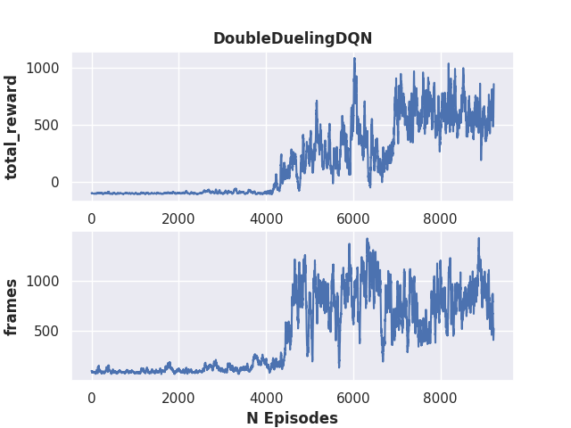

# VizDoom Environments

# Training DQN
[run_dqn_doom.py](scripts/run_dqn_doom.py) can be used to train the DQNs on VizDoom environments. This approach is the same as used for the atari environments, and is adequte for training the VizDoomBasic, but struggles with the VizDoomCorridor environment (others currently unexplored). 

VizDoomBasic:   

# Training DQN with bots
The other scripts in scripts/doom handle creating scripted bots, then using them to generate additional experience to use while training the DQN agent. There are currently 4 sequences these boths can use, see [rlk/environments/doom/bots/script_library.py](rlk/environments/doom/bots/script_library.py) to add new sequences for the bots to use. 

Note that the bot used here are scripts of actions; ie. literal lists of actions to take which could be done blind. This differs from the bots used in GFootball, which respond to the environment using a fixed policy (ie. if this, then do that...).   

 - [manual_play_doom.py](scripts/doom/manual_play_doom.py) - Optional: Use this script to play the environment manually using wasd controls. The action history can be added to [rlk/environments/doom/bots/script_library.py](rlk/environments/doom/bots/script_library.py) to add new sequences for the bots to use.  
 - [run_scripted_bot_doom.py](scripts/doom/run_scripted_bot_doom.py) - Optional: This script runs and renders a ScriptedBot in the environment.
 - [evaluate_bot_scripts.py](scripts/doom/evaluate_bot_scripts.py) - Optional: Runs all available bot sequences and shows average scores.
 - [run_dqn_doom_with_bot.py](scripts/doom/run_dqn_doom_with_bot.py) - Train a DQN on VizDoomCorridor using the "World" class. This manages the agent, additional experience collection from the ScriptedBots (4 by default), and the replay buffer. With the current agent set up the replay buffer is part of the agent, and additional experience is appended to it.  

VizDoomCorridor:

The DQN is able to learn with its own exploration plus the extra experience from the ScriptedBots and performs considerably better than the simpler training (as with VizDoomBasic above). It still requires a lot of training amd sometimes does some odd things, though. Here the agent was trained with a single ScriptedBot contributing experience between episodes ~0-7000, and with 4 ScriptedBots after episode ~7000. The score in this graph is a running average, and the max score is ~2200, and the agent is able to occasionally hit it. There's a good chance of the agent dying randomly even when performing well, so I doubt a max average score of 2000 is obtainable, but it can probably still be improved from this point with more training.  

Example episode using agent after ~8000 training episodes.

